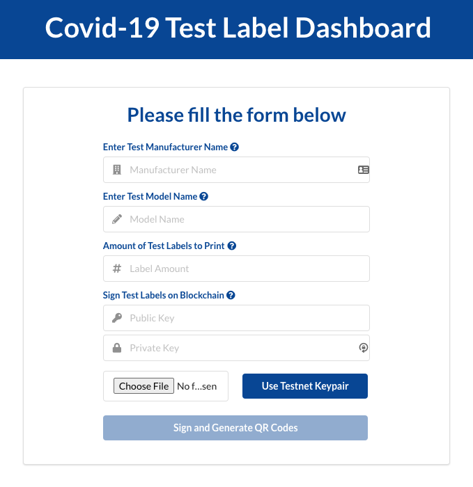

# COVID-19 Platform



This contract is designed to provide covid-19 tracking platform on Kadena blockchain.

## Governance
The contract is governed by a capability, "GOVERNANCE". The capability is guarded by the guard of the coin account, `covid-admin`.

Learn more about Module Governance [here](https://pact-language.readthedocs.io/en/stable/pact-reference.html#generalized-module-governance)

## Tables
The contract contains a history table to track the receiver account's activity with the faucet account.
- **test-table-three** : `test-manufacturer` `test-model` `age-group` `gender` `country` `zipcode` `result` `patient-hash` `last-mod-time` `pub-key-init-bh` `test-init-bh` `test-end-bh`
- **printer-table-three** : `authorized` `entity-name` `test-pub-keys`

Learn more about Pact tables [here](https://pact-language.readthedocs.io/en/latest/pact-reference.html#deftable)


## Functions

### create-printing-entity
  - Function for Admin to create a Printing Entity: `pub-key``entity-name`
```
(create-printing-entity "some pub key" "some entity")
```  

### register-test
  - Function for a Printing Entity to register a public key on a chain: `printer-pub-key` `test-manufacturer` `test-model` `accts`

```
(register-test "somePublicKeyForPrinter0" "some manufacturer 0" "some model 0" [{"acct-name": "key-one", "ks-name": "ks1"},{"acct-name": "key-two", "ks-name": "ks2"}]))
```

### administer-test
- Function for a Registered Test to administer a test and write demographic info: `pub-key` `age-group` `gender` `country` `zipcode` `patient-hash`
```
(administer-test "randomPubKey" "0-10" "male" "USA" "11249" "someRandomHash")
```

### end-test
- Function for a Registered Test to end a test and write result: `pub-key` `result`

Learn more about Pact functions [here](https://pact-language.readthedocs.io/en/latest/pact-reference.html#defun)

## Demo

The Contract is deployed on Kadena Testnet, and is usable [here](https://covid19-dashboard.chainweb.com/)
