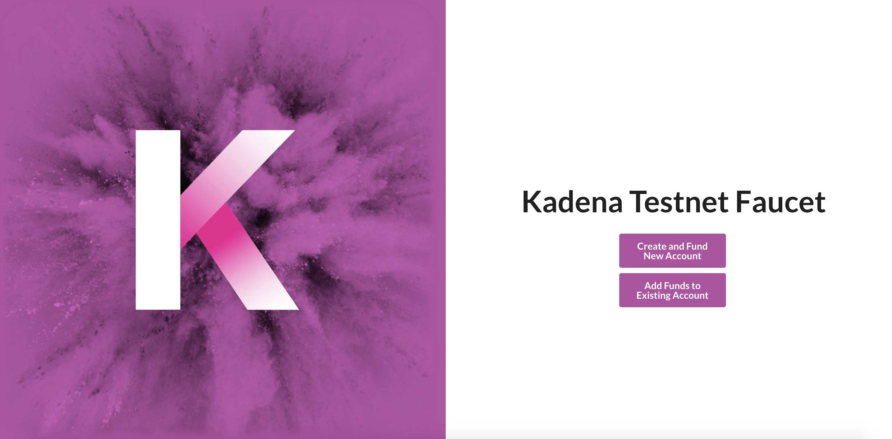

# Coin Faucet



This contract is designed to provide free KDA tokens Kadena testnet.
- The tokens are held in coin account, `coin-faucet`. This account is guarded by a module guard, `faucet-guard`. Read about module guards [here](https://pact-language.readthedocs.io/en/latest/pact-reference.html#module-guards).
- Each of the receiver accounts have time stamped in the contract.
- The maximum amount of coins to request at once is 20 KDA.
- If receiver has received coins in less than 30 minutes, then coin request is aborted.
- There are two types of requests. When one has a coin account, they should `request-coin`. However, if no account exists on network, `create-and-request-coin` will create an account and send the tokens to the account. The functions each use `coin.transfer` and `coin.transfer-create` to do this.

## Governance
The contract is governed by a capability, "GOVERNANCE". The capability is guarded by the guard of the coin account, `contract-admins`.

Learn more about Pact module governance [here](https://pact-language.readthedocs.io/en/stable/pact-reference.html#generalized-module-governance).

## Tables
The contract contains a history table to track the receiver account's activity with the faucet account.
- **history-table** : `total-coins-earned` `total-coins-returned` `last-request-time`

Learn more about Pact tables [here](https://pact-language.readthedocs.io/en/latest/pact-reference.html#deftable)

## Functions

### request-coin
  - Transfers KDA tokens from faucet account to receiver: `address` `amount`
    - Enforces that the requested amount is less than MAX_COIN_PER_REQUEST, which is 20.0 in this module
    - Reads the history table and enforce that the request's account had not requested in 30 minutes
    - `coin.transfer` `amount` from `FAUCET_ACCOUNT` to `address`.
    - Updates the receiver's history table.
```
(request-coin "test-account" 10.0)
```  

### create-and-request-coin
  - Create a new receiver account and transfer KDA token from faucet account to receiver: `address` `address-guard` `amount`
    - Enforces that the requested amount is less than MAX_COIN_PER_REQUEST, which is 20.0 in this module
    - `coin.transfer-create` `amount` from `FAUCET_ACCOUNT` to `address`
    - Updates the receiver's history table.
```
  (create-and-request-coin "test-account" (read-keyset "test-keyset") 10.0)
```

### return-coin
  - transfers KDA token from receiver account to faucet account: `address` `amount`
```
  (return-coin "test-account" 10.0)
```

Learn more about Pact functions [here](https://pact-language.readthedocs.io/en/latest/pact-reference.html#defun)

## Demo

The Contract is deployed on Kadena Testnet, and is usable [here](https://faucet.testnet.chainweb.com/)
