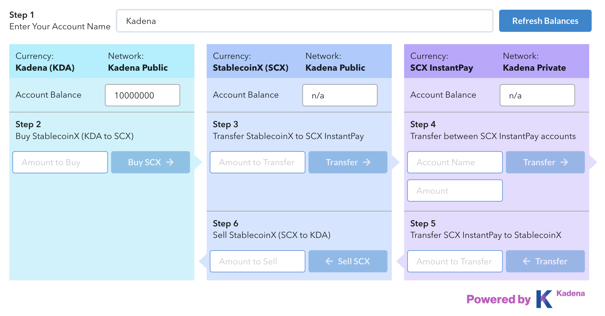

# Hybrid Dapp



This contract demonstrates hybrid platform that allows token conversion between one blockchain and another.


## Governance
The contract is governed by a capability, "GOVERNANCE". The capability is guarded by the guard of the coin account, `contract-admins`.

Learn more about Module Governance [here](https://pact-language.readthedocs.io/en/stable/pact-reference.html#generalized-module-governance)

## Tables
The contract contains a history table to track the receiver account's activity with the faucet account.
- **hybrid-table** : `ht-balance` `coins-in` `coins-out` `ht-account` `req-history`
- **tx-table** : `account` `amount` `status` `time`

Learn more about Pact tables [here](https://pact-language.readthedocs.io/en/latest/pact-reference.html#deftable)

## Functions

### buy-ht
  - Transfers KDA tokens from user account to admin account: `account` `amount`
  - Update the same amount of value from admin's hybrid tokens to user account on `hybrid-table`.
```
(buy-ht "test-user" 10.0)
```  

### sell-ht
  - Transfers KDA tokens from admin account to user account: `account` `amount`
  - Update the same amount of value from user's hybrid tokens to admin account on `hybrid-table`.
```
(sell-ht "test-user" 10.0)
```

### trans-to-priv
  - Transfer hybrid token to a private blockchain: `account` `amount`
  - Subtract hybrid token on hybrid-table and add the value on the private blockchain.
```
  (trans-to-priv "test-user" 10.0)
```

Learn more about Pact functions [here](https://pact-language.readthedocs.io/en/latest/pact-reference.html#defun)

## Demo

The Contract is deployed on Kadena Testnet, and is usable [here](https://hybrid.chainweb.com/)
