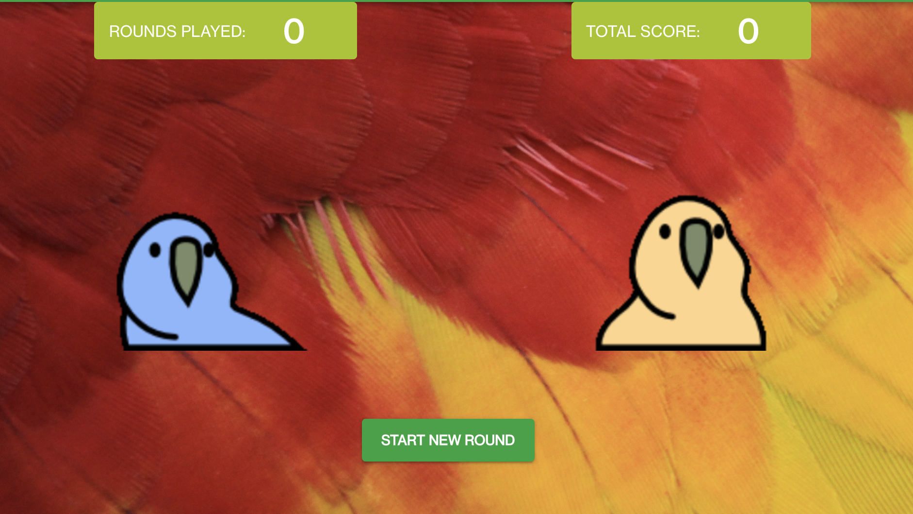

# Pacty Parrots



Pacty Parrots is the first game contract on Kadena testnet.
-

## Governance
The contract is governed by a capability, "GOVERNANCE". The capability is guarded by the guard of the coin account, `contract-admins`.

Learn more about Module Governance [here](https://pact-language.readthedocs.io/en/stable/pact-reference.html#generalized-module-governance)

## Tables
The contract contains a user games table to track the user's activity and status.
- **user-games-table** : `rounds-played` `coins-in` `coins-out` `total-rolls` `rounds`

Learn more about Pact tables [here](https://pact-language.readthedocs.io/en/latest/pact-reference.html#deftable)

## Functions

### start-round
  - Transfers 5 tokens from the user account to parrot bank account: `account`
  - Calls `parrot-draw` function which calculates the amount and update the table with the result.
```
(start-round "test-user")
```  

### end-round
  - Transfers the round's earned tokens from parrot bank account to user account: `account`
  - Updates the user activity in the table.
```
(end-round "test-user")
```  

Learn more about Pact functions [here](https://pact-language.readthedocs.io/en/latest/pact-reference.html#defun)

## Demo

The Contract is deployed on Kadena Testnet, and is usable [here](https://pactyparrots.testnet.chainweb.com/)
