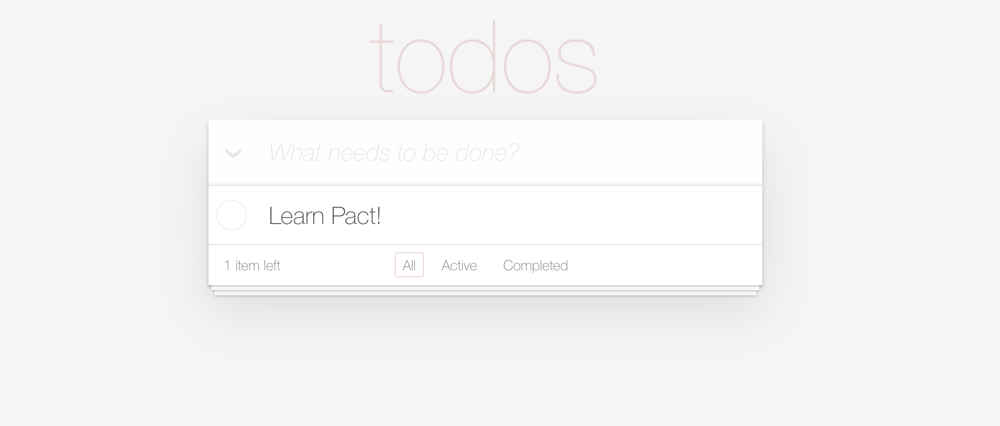

# Todos



## Governance
The contract is governed by a keyset, "loans-admin-keyset"

Learn more about Pact keysets [here](https://pact-language.readthedocs.io/en/latest/pact-reference.html#keysets-and-authorization)

## Tables
The contract contains a todo table to track the todo list and manage the status of each items.
- **todo-table** : `title` `completed` `deleted`

Learn more about Pact tables [here](https://pact-language.readthedocs.io/en/latest/pact-reference.html#deftable)

## Functions

### new-todo
  - Add a new todo item to the table: `id` `title`
```
(new-todo "todo-0" "Learn about Pact!")
```  

### toggle-todo-status
  - Toggle the status of the todo item: `id`
  - Updates the item's `completed` field to it's oppisite state.
```
(toggle-todo-status "todo-0")
```

### edit-todo
  - Edit the title of the todo item: `id` `title`
  - Updates the item's `title` field to the new title.
```
(edit-todo "todo-0" "Learn about Kadena!")
```

### delete-todo
  - Delete the todo item from the todo list: `id`
  - Update the item's `delete` field to `true`
```
(delete-todo "todo-0")
```

Learn more about Pact functions [here](https://pact-language.readthedocs.io/en/latest/pact-reference.html#defun)

## Demo

The step by step tutorial on how this contract will work with the frontend can be found [here](https://pactlang.org/intermediate/pact-and-javascript/)
Also, take a look at the project github [here](https://github.com/kadena-io/pact-todomvc)
