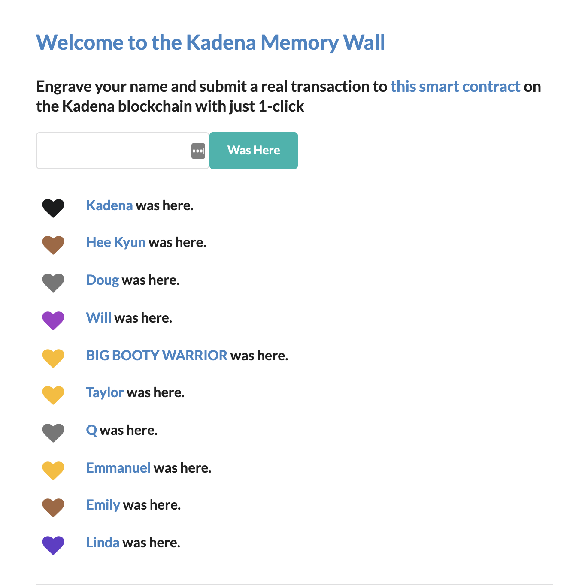

# Memory Wall

The contract is a simple contract to engrave name to Kadena blockchain.

## Governance
The contract is governed by a capability, "GOVERNANCE". The capability is guarded by the keyset, `hello-keyset`

Learn more about Pact keysets [here](https://pact-language.readthedocs.io/en/latest/pact-reference.html#keysets-and-authorization)

## Tables
The contract contains a name table to track users who greeted.
- **name-table** : `name`

Learn more about Pact tables [here](https://pact-language.readthedocs.io/en/latest/pact-reference.html#deftable)

## Functions

### here
  - Function to call that user was here: `user`
  - Adds a row with the key, the nth number to greet with the contract, to `name-table` and count up the row, `total`
```
(here "my-name")
```  

### lookup
  - Takes in the key and return the name: `key`
  - Used to fetch the names who greeted.

Learn more about Pact functions [here](https://pact-language.readthedocs.io/en/latest/pact-reference.html#defun)

## Demo

The Contract is deployed on Kadena Mainnet. Go sign your name [here](https://hello.chainweb.com/)
